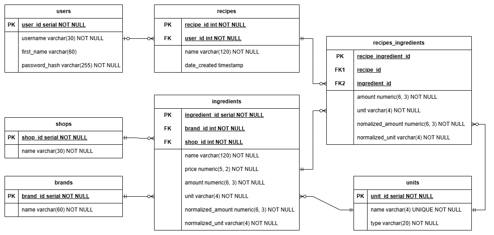

# Backend for My Kitchen Accountant

The backend for My Kitchen Accountant is a Python application, built to generate the database of items available for purchase from common UK supermarkets, and handle API endpoints for users adding the ingedients to recipes for cost-per-portion analysis.

## Database

The database module `db` is responsible for managing connections to a postgresql database, schema definitions, and data operations. It handles the inserting/updating of scraped data to the database, as well as any required lookups.

The ER diagram for the database is shown below:

The `units` and `shops` tables are manually seeded during set up. `brands` and `ingredients` are populated during web scraping.

## Scraping

The scraping module `scraping` handles the initial database population with ingredient data from UK supermarket websites (currently supported supermarkers: Aldi only). The data can be re-scraped to stay up to date with current pricing. Any new ingredients will be added to the database, and any ingredients that were previously in the database but were not found in the most recent scrape are flagged as not found, and a user warning will be raised where they are used in recipes.